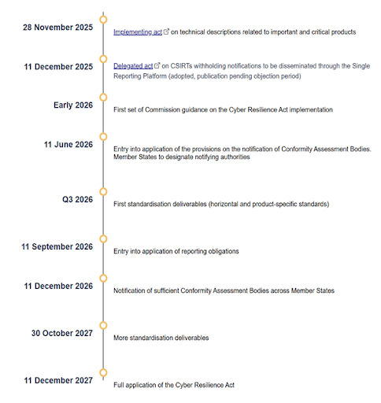

## CRA Updates
- [OpenSSF CRA Blog](https://openssf.org/category/policy/cra/)
- [European Commission CRA Implementation Website](https://digital-strategy.ec.europa.eu/en/factpages/cyber-resilience-act-implementation)
- [European Commission FAQ Document - v1](https://ec.europa.eu/newsroom/dae/redirection/document/122331)
- [CRA Experts Group](https://ec.europa.eu/transparency/expert-groups-register/screen/expert-groups/consult?lang=en&groupID=3967)
- [OpenSSF Presentations](https://github.com/ossf/wg-globalcyberpolicy/tree/main/docs/CRA/presentations/)

## Stewards Guidance
- [The Linux Foundation Leadership CRA Stewards One Pager](stewards-one-pager.html)
- [The Linux Foundation CRA Stewards Playbook](stewards-playbook.html)

## Standards
- [CRA Standards Map](standards.html)
- [Standardization Special Interest Group Updates](https://github.com/ossf/wg-globalcyberpolicy/tree/main/docs/CRA/presentations/standardization-sig/)
- [ESOs Overview](eso-overview.html)
- [OpenSSF Feedback on Draft Standards](https://github.com/ossf/wg-globalcyberpolicy/tree/main/docs/CRA/files/standards-feedback/)

## Checklists
- [OSS Stewards Obligations Checklist](checklists/OSS_Stewards_Obligations_Checklist.html)
- [PSIRT Obligations Checklist](checklists/PSIRT_Obligations_Checklist.html)

## EU Authorities
- [Market Surveillance Authorities (MSA)](https://webgate.ec.europa.eu/single-market-compliance-space/market-surveillance/ms-authorities?filter=legislationId:9021)
- [Administrative Cooperation Groups (AdCos)](https://single-market-economy.ec.europa.eu/single-market/goods/building-blocks/market-surveillance/organisation/adcos_en)
- [Conformity Assessment Bodies](https://single-market-economy.ec.europa.eu/single-market/goods/building-blocks/accreditation-conformity-assessment-bodies_en)
- [Market Surveillance (ICSMS)](https://webgate.ec.europa.eu/single-market-compliance-space/market-surveillance)
- [Notified Bodies](https://webgate.ec.europa.eu/single-market-compliance-space/notified-bodies/notified-body-list?filter=legislationId:164702,notificationStatusId:1)

## Additional Links
- [ENISA Single Reporting Platform](https://www.enisa.europa.eu/topics/product-security-and-certification/single-reporting-platform-srp)
- [CSIRTs Network](https://csirtsnetwork.eu/)
- [Implementing regulation (EU) 2025/2392](https://eur-lex.europa.eu/legal-content/EN/TXT/?uri=CELEX%3A32025R2392&qid=1764577062755): Technical description of the categories of important and critical products with digital elements
- [Delegated act on terms and conditions for CSIRTs](https://eur-lex.europa.eu/legal-content/EN/TXT/?uri=PI_COM%3AC%282025%298407&qid=1765524819538):  Specifies the terms and conditions for applying the cybersecurity-related grounds in relation to delaying the dissemination of notifications

## CRA Timeline

