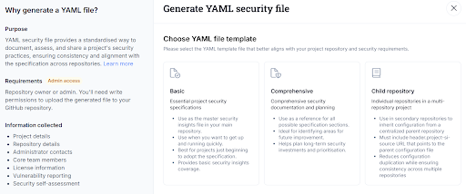

## What This Is

This is a short guide that will help you to implement voluntary good security practice and improve the quality and robustness of your projects that are aligned with the [EU Cyber Resilience Act (CRA)](https://openssf.org/public-policy/eu-cyber-resilience-act/).

Open source developers and maintainers contribute essential digital infrastructure used across society. Many projects are created through voluntary effort for the common good, forming the foundation of modern software ecosystems.

To be absolutely clear: **you don’t have to do anything at all because of the CRA**, if you’re maintaining an open source project without commercial monetization or placing products on the EU market.  This applies to *almost all* open source projects. The CRA does not impose obligations on individual open source developers or volunteer maintainers merely for publishing or maintaining code. It further clarifies that the regulation does not apply to natural or legal persons who contribute source code to free and open-source software that is not under their responsibility ([Recital 18](https://eur-lex.europa.eu/legal-content/EN/TXT/HTML/?uri=OJ:L_202402847#rct_18)).

However, you **may voluntarily choose** to implement widely accepted security best practices that align with modern secure development expectations and may assist downstream users who integrate your software into regulated products. Doing so will make your project more attractive for downstream consumers to use and contribute back to.

Under the CRA, manufacturers placing products with digital elements on the EU market are required to exercise due diligence when integrating software components, including third-party and open source components, as part of ensuring that their products meet the applicable cybersecurity requirements.

Open source maintainers are not responsible for performing this due diligence. This responsibility cannot be delegated upstream to open source maintainers or contributors, even when their software is used as part of a commercial product. However, voluntary transparency about project practices can make it easier for downstream users to perform their own legal responsibilities.

Read more: [Cyber Resilience Act (CRA) Brief Guide for Open Source Software (OSS) Developers](https://best.openssf.org/CRA-Brief-Guide-for-OSS-Developers). 

Since there are no regulatory requirements for most open source projects, the term “CRA Readiness” in this guide is used only as a voluntary transparency indicator that may help users understand that the project follows recognized security and engineering practices. It is not a legal status, certification, or regulatory designation. It is a communication and transparency practice intended to support trust, security, and responsible downstream use.

## What CRA Due Diligence Means for Your Users (Not for You)

Organizations that place products with digital elements on the market  ([art. 3.21](https://eur-lex.europa.eu/legal-content/EN/TXT/HTML/?uri=OJ:L_202402847#art_3)) must ensure that those products meet the cybersecurity requirements of the EU Cyber Resilience Act. As part of this responsibility, manufacturers are required to exercise due diligence when integrating third-party components, including free and open source software, to ensure that those components do not compromise the cybersecurity of the final product and thus adversely impact the end-consumer. Higher-risk components or products may require more extensive evaluation and testing, while lower-risk components may require proportionally lighter assessment.

In practice, due diligence may involve activities such as reviewing whether a component is actively maintained, checking for known vulnerabilities, verifying that security updates are released, assessing the existence of a vulnerability disclosure process, reviewing support expectations, and performing additional testing or validation when risks are higher. Manufacturers must also monitor components and manage vulnerabilities throughout the lifecycle of their products. This lifecycle responsibility applies to the manufacturer’s product as a whole, including all integrated components.

**Open source maintainers are not responsible for performing due diligence**. This responsibility always remains with the manufacturer or organization placing the product on the market, even when the product integrates open source components that are not themselves subject to the CRA. Manufacturers may rely on available documentation, security practices, and publicly accessible information when assessing components, but the final responsibility for product security and compliance remains downstream.

The mere fact that manufacturers integrate free and open source software components into their own products does not change the legal status of those components under the CRA. Whether the CRA applies to a software component depends solely on whether the entity that publishes it places it on the market. Manufacturers of products with digital elements that integrate open source components are required to comply with the CRA for their own products and they have a due diligence obligation toward the components they integrate and must report vulnerabilities and share relevant security fixes with the maintainers of those components.

Maintainers and developers may voluntarily support downstream users by providing transparent and well-documented project practices, such as publishing security policies, maintaining release documentation, documenting support expectations, and responding to vulnerability reports. These voluntary actions can make it easier for users to perform their own due diligence and risk assessments, but they do not create regulatory obligations, compliance responsibilities, or liability for maintainers. Doing so should limit churn from constant downstream requests asking for such artifacts, allowing the project and its developers to focus on delivering the project’s goals.

## How To Approach “CRA Readiness”

There is currently no “official” CRA Readiness certification or standard for open source projects. There are a number of efforts underway on how to approach CRA Readiness, including OpenSSF Global Cyber Policy Working Group, OpenSSF Orbit WG, Open Source Project Security Baseline (OSPS)  and others.

The following simplified CRA Readiness checklist represents minimal voluntary practices for your open source project that also makes sense from the good software engineering and open source security practices.

These practices are widely recognized as good engineering and security hygiene. They are not legal obligations for non-commercial open source projects and should not be interpreted as regulatory requirements.

### Voluntary "CRA-Friendly" Checklist

| Item                                                  | Description                                                                                                                                                                                                                                                                                                                                                                                                                          | Notes and Examples                                                                                                                                                                                                                                                                                                                                                                                                                                                                                                                                                                                                                                                                                                                                                                                                                                                                                                                                                                                                                                                                                                                                             | Link to artefact                                                                                                 |
| :---------------------------------------------------: | :----------------------------------------------------------------------------------------------------------------------------------------------------------------------------------------------------------------------------------------------------------------------------------------------------------------------------------------------------------------------------------------------------------------------------------: | :------------------------------------------------------------------------------------------------------------------------------------------------------------------------------------------------------------------------------------------------------------------------------------------------------------------------------------------------------------------------------------------------------------------------------------------------------------------------------------------------------------------------------------------------------------------------------------------------------------------------------------------------------------------------------------------------------------------------------------------------------------------------------------------------------------------------------------------------------------------------------------------------------------------------------------------------------------------------------------------------------------------------------------------------------------------------------------------------------------------------------------------------------------: | :--------------------------------------------------------------------------------------------------------------: |
| **Cybersecurity and Vulnerability Management Policy** | A published policy must, at a minimum, address: 1) Secure development practices 2\) How project risks are handled 3\) Contact information for security and vulnerability questions 4\) The processes for vulnerability reporting, identification, remediation, patching, coordinated disclosure 5\) End of line plan that defines the intended support period for addressing vulnerabilities and the end-of-life process | A publicly and clearly accessible file or a section. It may be in the project's official documentation, a contributor guide, or within an .md in the repo, e.g. part of SECURITY.md or security.txt. Examples: [Example 1](https://github.com/kubevirt/kubevirt?tab=security-ov-file), [Example 2](https://github.com/uxlfoundation/oneDNN?tab=security-ov-file), [Example 3](https://github.com/nodejs/node?tab=security-ov-file) (advanced), [Example 4](https://github.com/tensorflow/tensorflow?tab=security-ov-file)(advanced), [Example 5](https://docs.djangoproject.com/en/dev/internals/security/) (external reference), [Example 6](https://www.python.org/dev/security/) (external reference). A publicly documented policy increases transparency and helps downstream users understand how vulnerabilities are handled. This information may support downstream risk assessment and due diligence processes. Publishing such a policy improves transparency but does not create legal obligations for maintainers. It also helps downstream users understand how to responsibly report vulnerabilities and coordinate remediation when necessary. | \[Link to your Policy\]                                                                                          |
| **Contributing Guidance**                             | Contributing guidance (or how to join) should include explicit links to secure development practices.                                                                                                                                                                                                                                                                                                                                | CONTRIBUTING.md file is commonly used for this purpose, but it could be on the website or documentation page. Examples: [Example 1](https://gist.github.com/PurpleBooth/b24679402957c63ec426), [Example 2](https://github.com/uxlfoundation/oneDNN?tab=contributing-ov-file). Clear contribution processes help users understand how code changes are reviewed and managed, which may support downstream supply-chain integrity assessments.                                                                                                                                                                                                                                                                                                                                                                                                                                                                                                                                                                                                                                                                                                                   | \[link to your Contributing guidance\]                                                                           |
| **Release Documentation**                             | If you do releases or tags, ensure corresponding documentation describing new functionality or user guides. It should include Security fixes, if any.                                                                                                                                                                                                                                                                                | This documentation could be: CHANGELOG.md, release notes, documentation pages, version history. Examples: [Example 1](https://github.com/kubevirt/kubevirt/releases/tag/v1.7.0), [Example 2](https://github.com/kyverno/kyverno/blob/main/CHANGELOG.md), [Example 3](https://github.com/uxlfoundation/oneDPL/blob/main/documentation/release_notes.rst). Maintaining release documentation helps downstream users: track security updates, verify patch availability, manage lifecycle risks, maintain internal documentation. This information may support downstream due diligence and maintenance planning.                                                                                                                                                                                                                                                                                                                                                                                                                                                                                                                                                 | \[Example link to the latest Release docs or Logs\]                                                              |
| **Bug Reporting Guide**                               | Document process for reporting issues/bugs/defects. This should be clearly distinguished from security reporting.                                                                                                                                                                                                                                                                                                                    | Can be in the same file as the contributing guide or included to the release process description. Examples: [Example 1](https://github.com/kyverno/kyverno/blob/main/CONTRIBUTING.md) (part of CONTRIBUTING.md), [Example 2](https://github.com/nodejs/node/blob/main/doc/contributing/issues.md#submitting-a-bug-report) (part of ISSUES.md). Clear distinction between security vulnerabilities and general bugs helps downstream users respond appropriately to security issues and integrate responsible disclosure workflows into their own processes.                                                                                                                                                                                                                                                                                                                                                                                                                                                                                                                                                                                                    | \[Link to the doc where you explain how to report non-security bugs\]                                            |
| **MFA Enforcement**                                   | If your project platform supports it, enable MFA for all contributors. This is strongly recommended for high-privileged roles such as administrators or maintainers.                                                                                                                                                                                                                                                                 | \- [How to enable MFA in GitHub](https://docs.github.com/en/authentication/securing-your-account-with-two-factor-authentication-2fa/configuring-two-factor-authentication) Enabling Multi-Factor Authentication reduces the risk of unauthorized changes to the codebase and strengthens supply-chain integrity, which may increase confidence for downstream users performing security assessments.                                                                                                                                                                                                                                                                                                                                                                                                                                                                                                                                                                                                                                                                                                                                                        | \[A brief statement that you’ve done it on your platform, optionally - how\]                                     |
| **Branch Protection**                                 | If your project platform supports it, enable branch protection in org or repo settings.                                                                                                                                                                                                                                                                                                                                              | \- [Branch Protection in GitHub](https://docs.github.com/en/repositories/configuring-branches-and-merges-in-your-repository/managing-protected-branches/managing-a-branch-protection-rule) Branch protection mechanisms help demonstrate that changes to the codebase are reviewed and controlled, supporting downstream trust in software integrity.                                                                                                                                                                                                                                                                                                                                                                                                                                                                                                                                                                                                                                                                                                                                                                                                       | \[A brief statement that you’ve done it on your platform, optionally - how\]                                     |
| **Licence File**                                      | Repository should contain a clear LICENSE or COPYING file.                                                                                                                                                                                                                                                                                                                                                                           | It’s strongly recommended for open source projects to use one of the commonly used licences, e.g from [OSI Approved Licenses catalogue](https://opensource.org/licenses). - [Example](https://github.com/kubevirt/kubevirt?tab=Apache-2.0-1-ov-file) A clear license helps: define usage rights, clarify responsibility boundaries, reduce legal ambiguity, support component evaluation. A clear license also helps prevent misunderstanding regarding liability and responsibility boundaries. It clarifies the terms under which the software is provided and helps avoid assumptions about warranties or support obligations.                                                                                                                                                                                                                                                                                                                                                                                                                                                                                                                           | \[Link to your licence file\]                                                                                    |
| **OSPS**                                              | Achieve Open Source Project Security Baseline (OSPS) Level 1, at minimum. NOTE: If you implemented all the above, you most likely almost achieved OSPS L1 already.                                                                                                                                                                                                                                                                   | Achieving OSPS Level 1 typically demonstrates implementation of basic security and governance practices that are commonly reviewed during downstream component due diligence. Many of the practices described in this guide align closely with the expectations of the Open Source Project Security Baseline. More details at [baseline.openssf.org](http://baseline.openssf.org).                                                                                                                                                                                                                                                                                                                                                                                                                                                                                                                                                                                                                                                                                                                                                                             | \[You can publish or link to a [OSPS checklist](https://baseline.openssf.org/versions/2025-10-10-checklist.md)\] |

## Voluntary Practices Do Not Transfer CRA Responsibility

All activities described in this guide are voluntary engineering and transparency practices intended to improve software quality, security, and trust. They are not regulatory requirements and should not be interpreted as creating legal obligations for open source maintainers or developers. Implementing these practices does not establish legal responsibility, provide compliance assurances, transfer liability, or certify the security of a project or product. Under the EU CRA, responsibility for compliance and product security always remains with the entity that places the product on the market.

Open source maintainers and developers should exercise reasonable caution when interacting with downstream organizations that integrate their software into commercial products. In the course of normal collaboration, maintainers may receive requests to complete security questionnaires, participate in supplier onboarding processes, sign compliance declarations, or enter into support or partnership agreements. While these requests are often routine and made in good faith, they may sometimes include language that could unintentionally attempt to shift regulatory responsibility upstream to the maintainers.

For this reason, maintainers should carefully review any documents or commitments that could be interpreted as accepting responsibility for regulatory compliance, product security, or vulnerability outcomes. In particular, maintainers should avoid agreeing to assume CRA compliance responsibilities, certify the security of downstream products, guarantee the absence of vulnerabilities, accept regulatory obligations, provide formal compliance assurances, or act in a role equivalent to a manufacturer or supplier under product legislation.

As a general principle, liability under the CRA cannot be transferred to open source maintainers through contracts, agreements, or declarations. Responsibility remains with the manufacturer or other economic operator placing the product on the market, regardless of the origin of the software components used in that product. 

Also, we need to take into account that manufacturers contributing source code to the maintenance of an open source component do not become responsible for that component’s individual compliance with the CRA solely by virtue of their contribution.

## How To Document "CRA Readiness"

Ideally, the CRA Readiness needs to be documented in both human-readable and machine-readable formats. Such documentation is intended solely for transparency and communication, not regulatory compliance. Publicly sharing this information should allow your downstream consumers and government officials to gain answers to their questions without needing to interrupt the project team.

### Human-readable (default option)

Simply create a file in your repo that contains the table (checklist) above. Link this file from your readme.md for easy navigation. To avoid any misunderstanding, include a clear disclaimer stating:

*"This project voluntarily documents its security practices.
This information is provided "as is", without warranties or guarantees.

The maintainers and contributors:

- have no obligations under the EU CRA,
- are not Manufacturers, Importers, or Economic Operators,
- assume no financial, contractual, or legal liability,
- and do not provide CRA compliance assurances.

Entities incorporating this software into commercial products remain solely responsible for regulatory compliance, risk assessment, and vulnerability management."*

The above statement can be complemented with the additional legal references ([Example can be found here](https://cra.orcwg.org/faq/maintainers/transparency/)).

Optionally, the good practice is to create a separate file (Example of a CNCF project security self-assessment.md) that compiles your project security posture, secure development processes, threat model and related details, where you can also add or link the Checklist Table above.

### Machine-readable (advanced option)

Convert the checklist table above into machine-readable format and add it to overall description of your security posture, for example in a format of [security-insights.YAML](http://github.com/ossf/security-insights-spec).

- [Example](https://github.com/kyverno/kyverno/blob/main/SECURITY-INSIGHTS.yml)

Using the [OpenSSF Scorecard](https://github.com/ossf/scorecard?tab=readme-ov-file) you can provide an automated, machine-readable "security score" that users can pull into their due diligence tools.

TIP: In the [LFX Insights](https://insights.linuxfoundation.org/) you can generate a YAML security file right from the interface (go to your project “Security & Best Practices” section).

## Get Help and Next Steps

If you have any CRA-related questions, please ask them right away here: [OpenSSF Global Cyber Policy (GCP) Slack](https://openssf.slack.com/archives/C084A6XPX0F).

If you wish to further improve your project security posture and follow the spirit of the CRA, consider exploring:

- [Generate SBOMs](https://openssf.org/technical-initiatives/sbom-tools/)
- Consider implementing [Supply-chain Levels for Software Artifacts (SLSA)](https://slsa.dev/), start with Level 1
- Obtain an [OpenSSF Best Practices Badge](https://www.bestpractices.dev/en)
- Consider achieving [OSPS Baseline Level 2 and Level 3](https://openssf.org/projects/osps-baseline/)
- Automate compliance with [Gemara](https://openssf.org/projects/gemara/)
- Automate repo security with [Minder](https://openssf.org/projects/minder/)
- Implement continuous checks with [OpenSSF Scorecard](https://github.com/ossf/scorecard)

Remember: all these activities are engineering improvements and voluntary transparency measures which should make your project more appealing and easier for downstream entities to integrate. 
They are not legal requirements for most open source projects and do not create regulatory obligations. 

Open source maintainers already:

- Contribute critical infrastructure.
- Donate time and expertise
- And enable innovation across the digital economy

The intent of supporting CRA-related practices across open source ecosystems is to support, not burden, maintainers and contributors. Responsible downstream behavior and clear responsibility boundaries are essential for sustainable open source security.
