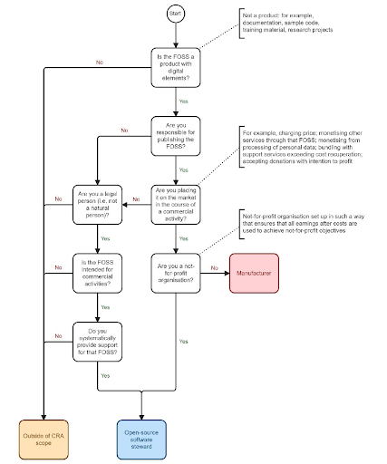
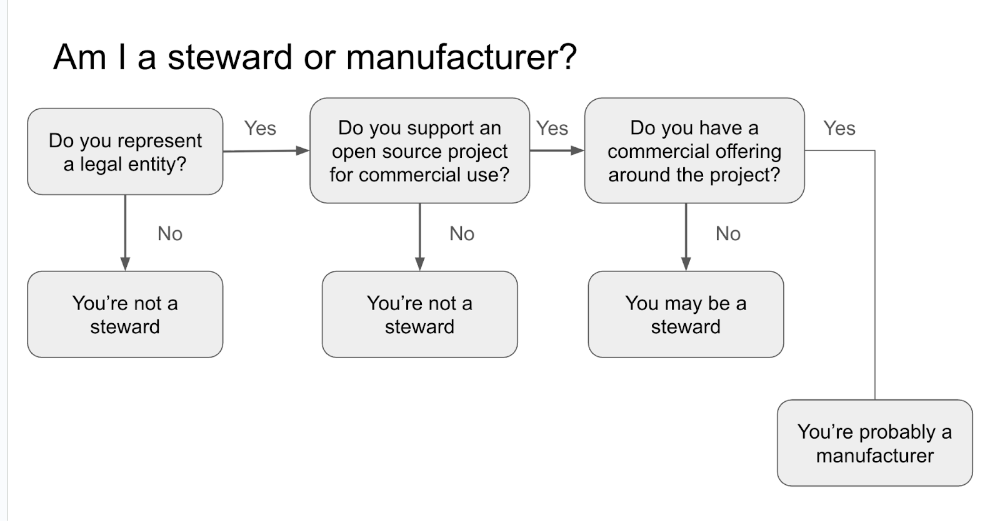
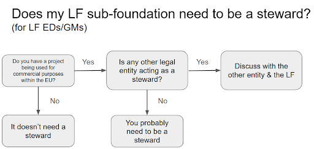
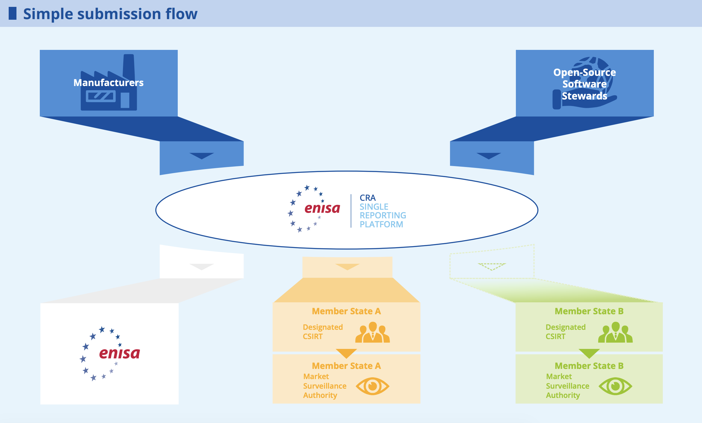
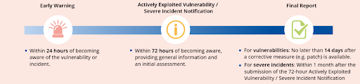

Congratulations\!  You get to be an open source Steward as outlined within the [EU’s Cyber Resilience Act (CRA)](https://eur-lex.europa.eu/legal-content/EN/TXT/HTML/?uri=OJ:L_202402847#art_3). You are vitally important in supporting upstream projects, developers, and maintainers as they go about the task of maintaining and creating innovative solutions that solve the world’s problems. The Steward role was recognized early on by EU policymakers as distinct from the software creators and the commercial organizations that sell products using those technologies.

While open source software stewards are not subject to the full obligations imposed on manufacturers under this Regulation *(and therefore may not affix the CE marking to supported digital products)*, they remain responsible for implementing a security strategy, reporting vulnerabilities, and cooperating with market surveillance authorities to ensure the cybersecurity and integrity of open source projects. 

* TOC
{:toc}

## Executive Summary

The EU’s Cyber Resilience Act (CRA) is one of the most consequential pieces of legislation recently drafted and put into force. It combines cybersecurity hygiene, best practices, vulnerability reporting, and documentation requirements that may be unfamiliar to many that work exclusively upstream. Please first consult the [CRA Stewards One-Pager](https://policy.openssf.org/CRA/stewards-one-pager.html) for more concise instructions. This playbook is designed to provide more in-depth details and instructions on how an Open Source Steward can fulfill their obligations, both under the law, but as well to the projects that are housed beneath them as well as the community of members and other participants within the ecosystem. 

The CRA created a new role, the Open Source Steward to help support upstream projects, maintainers and contributors but also the downstream projects and the manufacturers:

| *An ‘open-source software steward’ means a legal person, other than a manufacturer, that has the purpose or objective of systematically providing support on a sustained basis for the development of specific products with digital elements (PDEs), qualifying as free and open-source software and intended for commercial activities, and that ensures the viability of those products [(Article 3.14](https://eur-lex.europa.eu/eli/reg/2024/2847/oj))* |
| :---: |

This category reflects the “importance for cybersecurity of many products with digital elements qualifying as free and open source software that are published, but not made available on the market within the meaning of the \[CRA\]” (recital 19). A legal person may qualify as a steward only in relation to products with digital elements that constitute FOSS and are published, but not made available on the market within the meaning of the CRA.

For CRA purposes, software qualifies as FOSS only where both of the following conditions are met:
- FOSS license: the software is made available under a free and open source license that provides the rights to make it freely accessible, usable, modifiable, and redistributable; and
- Openly shared source code: the source code is openly shared and publicly available, either upstream or downstream.
An open source license alone is therefore not sufficient. Where software is distributed under a free and open-source license but its source code is available only to paying customers or a limited group of users, the software does not qualify as FOSS for the purposes of the CRA.

Once software has been established as FOSS under Article 3(48), the next step is to determine which natural or legal person, if any, has responsibility for that specific FOSS under the CRA. Responsibility should not be attributed solely on the basis of contributing source code or having technical access to a repository. The relevant consideration is who publishes the FOSS and exercises primary control over its development, releases, and distribution decisions.

A legal person may simultaneously assume different roles under the CRA: it may be a steward for one FOSS project and a manufacturer for another, including different versions of the same software (such as community and monetised versions). For each FOSS it publishes, the legal person must assess whether the software is made available on the market (triggering manufacturer obligations) or, if not, whether it is intended for commercial activities and supported in a manner that meets the definition of steward.

Before treating a FOSS project as being supported by a steward, check whether the FOSS itself is supplied as part of a commercial activity. A project may be free to use and still be placed on the market if, for example:
- a price is charged for the software or pre-compiled binaries;
- access to a paid or enhanced version is provided;
- access to important functionality or updates requires payment;
- the software is used to monetise other products or services;
- use of the software requires personal-data processing for purposes unrelated to security, compatibility or interoperability; or
- donations effectively become a condition for accessing the software, essential functionality or updates.
If the FOSS is freely available and is not otherwise monetised, it may not be placed on the market. In that case, assess whether the organization qualifies as a steward.

[Recital 19](https://eur-lex.europa.eu/legal-content/EN/TXT/HTML/?uri=OJ:L_202402847#rct_19) clarifies that sustained support includes activities such as hosting or managing development platforms, hosting source code or software, governing or managing FOSS projects, and steering their development. Foundations or other legal entities that provide such support for specific FOSS intended for commercial activities may therefore qualify as stewards in relation to those projects.

Stewards are formally recognized as entities that can support the compliance efforts of open source software projects and shared digital components. The regulation assigns them a limited but essential set of legal obligations, primarily focused on ensuring that secure development and vulnerability handling processes are in place, and that relevant information can be communicated effectively to market surveillance authorities when required. These obligations aim to establish a clear line of accountability for the security posture of software elements that may be integrated into products placed on the Union market. In fulfilling these duties, stewards act as a bridge between open source or collaborative development environments and the regulatory compliance expectations imposed on commercial manufacturers. 

Steward status is assessed for each specific FOSS project and can change over time.
If a steward stops providing systematic support on a sustained basis to a specific FOSS project, it may no longer meet the definition of a steward for that project. The organisation should clearly communicate the change in its role to the project and relevant stakeholders.
A steward may also become a Manufacturer if it later starts monetising the FOSS and places it on the EU market. In that case, the organisation becomes the Manufacturer from the point at which it places the FOSS on the market. This does not make it the Manufacturer of earlier versions for which it acted as a steward.

Where a specific FOSS is neither placed on the market within the meaning of the CRA nor meets the criteria for stewardship, the legal person is not subject to obligations under the CRA in relation to that FOSS. Not every project needs a Steward. Some stewards will support multiple projects within their community. The flowchart below is a starting point for clarifying if you are a steward or a manufacturer or both.

<small>Figure 1: Manufacturer vs Steward [^1]</small>

Further guidance will be provided by the European Commission on their [CRA Implementation webpage.](https://digital-strategy.ec.europa.eu/en/factpages/cyber-resilience-act-implementation)

## CRA Steward Obligations

The content of the table below is taken from the text of the CRA:

| Area | Citation | Requirement | *TL/DR* |
| ----- | ----- | :---- | :---- |
| *Cyber Policy* | [Article 24](https://eur-lex.europa.eu/legal-content/EN/TXT/HTML/?uri=OJ:L_202402847#art_24) | 1\. Open source software stewards shall **put in place and document i**n a verifiable manner **a cybersecurity policy** to foster the development of a secure product with digital elements as well as an **effective handling of vulnerabilities** by the developers of that product. That policy shall also foster the voluntary reporting of vulnerabilities as laid down in **Article 15** by the developers of that product and take into account the specific nature of the open source software steward and the legal and organisational arrangements to which it is subject. That policy shall, in particular, include aspects related to documenting, addressing and remediating vulnerabilities and promote the sharing of information concerning discovered vulnerabilities within the open source community. | *security.md \+vuln reporting process/link* |
| *Vuln Reporting and MSA cooperation* | [Article 24](https://eur-lex.europa.eu/legal-content/EN/TXT/HTML/?uri=OJ:L_202402847#art_24) | 2\. **Open source software stewards shall cooperate with the market surveillance authorities, at their request**, with a view to mitigating the cybersecurity risks posed by a product with digital elements qualifying as free and open source software. | *cooperate with M.S.A. to mitigate risks* |
|  |  | Further to a reasoned request from a market surveillance authority, open source software stewards shall provide that authority, in a language which can be easily understood by that authority, with the documentation referred to in paragraph 1, in  paper or electronic form. | *policy posted electronically* |
| *Vuln Reporting* | [Article 24](https://eur-lex.europa.eu/legal-content/EN/TXT/HTML/?uri=OJ:L_202402847#art_24) | 3\. The obligations laid down in **Article 14(1)** shall apply to open source software stewards to the extent that they are involved in the development of the products with digital elements. **The obligations** laid down in **Article 14(3) and (8)** **shall apply to open source software stewards to the extent that severe incidents having an impact on the security of products with digital elements affect network and information systems provided by the open source software stewards for the development of such products**. | *Report vulns and known exploits to the Union* |

<small>Table 1: List of CRA Stewards obligations</small>

In more plain language, here is what the Steward’s obligations come down to:

1. Have a vulnerability reporting process and publicly posted policy.  
2. Have a single point of contact for reporting and inquiring about vulnerabilities (e.g. [https://www.linuxfoundation.org/security](https://www.linuxfoundation.org/security))  
3. If approached by EU officials (Market Surveillance Authority (MSA), ENISA, National CSIRT, etc.) provide requested information.  
4. If the steward is involved in development of that product and becomes aware of an actively exploited vulnerability contained in it or if underlying network and information systems provided by the steward for development (e.g. CI/CD systems, websites, etc.) has suffered a cybersecurity severe incident, report to the ENISA Single Reporting Platform (SRP).

We will cover each of these requirements in more detail below.

Within the CRA, multiple economic-operator roles are defined, with the Manufacturer generally having the broadest set of obligations. A Manufacturer is the natural or legal person that develops or manufactures a Product with Digital Elements (PDE), or has it designed or developed, and places it on the EU market under its own name or trademark in the course of a commercial activity. This document focuses on the Open Source Steward role, but several of the requirements are similar between the two roles.  

<small>Figure 2: Manufacturer vs Steward</small>

Not every upstream project needs or wants a Steward. A Steward typically will have access to more resources than an unaffiliated single-maintainer project, which positions them to be able to assist projects within their community.

<small>Figure 3: LF sub-foundations as stewards</small>

Beyond their legally binding duties under the CRA, stewards play an important role in supporting the effective implementation of CRA requirements across the digital supply chain. Positioned at the intersection of open source communities, manufacturers, and regulators, they are well placed to help translate complex legal and cybersecurity requirements into actionable practices. In this context, stewards can support manufacturers, maintainers, and Micro, Small, and Medium Enterprises (MSMEs) in understanding and operationalising relevant CRA provisions, particularly where these actors lack the expertise or resources to navigate cybersecurity compliance independently. Their role is therefore not to assume manufacturers’ or other economic operators’ legal responsibilities, but to facilitate compliance, strengthen coordination across the ecosystem, and contribute to the practical implementation of the CRA’s cybersecurity objectives.

In practice, this expanded role could encompass capacity-building, mechanisms to ease compliance and knowledge transfer: 

- providing structured training, guidance, and mentoring;   
- developing standardized templates and tools to facilitate the compliance process;   
- and simplifying vulnerability reporting and documentation processes. 

By creating accessible pathways to compliance, stewards help to ensure a consistent and pragmatic implementation of the CRA across diverse technological domains, mitigating the disproportionate regulatory burden on smaller actors.

Through these voluntary yet essential contributions, stewards evolve from compliance facilitators into enablers of systemic resilience. Their proactive engagement strengthens trust and cooperation among stakeholders, promotes the sustainable adoption of secure development practices, and ensures that the CRA’s ultimate goal \- enhancing cybersecurity without negatively-impacting innovation \- is effectively achieved throughout the European digital ecosystem.

### Referenced obligations that were adapted for stewards:

| Area | Citation | Requirement | *TL/DR* |
| ----- | ----- | :---- | :---- |
| *Vuln Reporting* | [Article 15](https://eur-lex.europa.eu/legal-content/EN/TXT/HTML/?uri=OJ:L_202402847#art_15) | Manufacturers as well as other natural or legal persons may notify any vulnerability contained in a product with digital elements as well as cyber threats that could affect the risk profile of a product with digital elements on a voluntary basis to a CSIRT designated as coordinator or ENISA. | *notify ENISA \+ National CSIRT contact about discovered vulns* |
| *Vuln Reporting* | [Article 15](https://eur-lex.europa.eu/legal-content/EN/TXT/HTML/?uri=OJ:L_202402847#art_15) | Manufacturers as well as other natural or legal persons may notify any incident having an impact on the security of the product with digital elements as well as near misses that could have resulted in such an incident on a voluntary basis to a CSIRT designated as coordinator or ENISA. | *notify ENISA \+ National CSIRT contact about cyber incidents* |
| *Vuln Reporting* | [Article 15](https://eur-lex.europa.eu/legal-content/EN/TXT/HTML/?uri=OJ:L_202402847#art_15) | The CSIRT designated as coordinator or ENISA shall process the notifications referred to in paragraphs 1 and 2 of this Article in accordance with the procedure laid down in Article 16\. The CSIRT designated as coordinator may prioritise the processing of mandatory notifications over voluntary notifications. | *Select a National CSIRT to notify* |
| *Vuln Reporting* | [Article 15](https://eur-lex.europa.eu/legal-content/EN/TXT/HTML/?uri=OJ:L_202402847#art_15) |  Where a natural or legal person other than the manufacturer notifies an actively exploited vulnerability or a severe incident having an impact on the security of a product with digital elements in accordance with paragraph 1 or 2, the CSIRT designated as coordinator shall without undue delay inform the manufacturer. | *notify ENISA \+ National CSIRT contact about active exploited vulns* |
| *Vuln Reporting* | [Article 15](https://eur-lex.europa.eu/legal-content/EN/TXT/HTML/?uri=OJ:L_202402847#art_15) |  The CSIRTs designated as coordinators as well as ENISA shall ensure the confidentiality and appropriate protection of the information provided by a notifying natural or legal person. Without prejudice to the prevention, investigation, detection and prosecution of criminal offences, voluntary reporting shall not result in the imposition of any additional obligations upon a notifying natural or legal person to which it would not have been subject had it not submitted the notification. | *CSIRTs may contact Stewards for assistance* |
| *Vuln Reporting* | [Article 14](https://eur-lex.europa.eu/legal-content/EN/TXT/HTML/?uri=OJ:L_202402847#art_14) |  A manufacturer shall notify any actively exploited vulnerability contained in the product with digital elements that it becomes aware of simultaneously to the CSIRT designated as coordinator, in accordance with paragraph 7 of this Article, and to ENISA. The manufacturer shall notify that actively exploited vulnerability via the single reporting platform established pursuant to Article 16\. | *establish an EU National CSIRT contact, report known actively exploited vulns to EU National CSIRT contact and ENISA* |
| *Vuln Reporting* | [Article 14](https://eur-lex.europa.eu/legal-content/EN/TXT/HTML/?uri=OJ:L_202402847#art_14) | For the purposes of the notification referred to in paragraph 1, the manufacturer shall submit: an early warning notification of an actively exploited vulnerability, without undue delay and in any event within 24 hours of the manufacturer becoming aware of it, indicating, where applicable, the Member States on the territory of which the manufacturer is aware that their product with digital elements has been made available; unless the relevant information has already been provided, a vulnerability notification, without undue delay and in any event within 72 hours of the manufacturer becoming aware of the actively exploited vulnerability, which shall provide general information, as available, about the product with digital elements concerned, the general nature of the exploit and of the vulnerability concerned as well as any corrective or mitigating measures taken, and corrective or mitigating measures that users can take, and which shall also indicate, where applicable, how sensitive the manufacturer considers the notified information to be; © unless the relevant information has already been provided, a final report, no later than 14 days after a corrective or mitigating measure is available, including at least the following: a description of the vulnerability, including its severity and impact; where available, information concerning any malicious actor that has exploited or that is exploiting the vulnerability; details about the security update or other corrective measures that have been made available to remedy the vulnerability. | *establish an EU National CSIRT contact, report actively exploited vulns to EU National CSIRT contact and ENISA* |
| *Vuln Reporting* | [Article 14](https://eur-lex.europa.eu/legal-content/EN/TXT/HTML/?uri=OJ:L_202402847#art_14) |  A manufacturer shall notify any severe incident having an impact on the security of the product with digital elements that it becomes aware of simultaneously to the CSIRT designated as coordinator, in accordance with paragraph 7 of this Article, and to ENISA. The manufacturer shall notify that incident via the single reporting platform established pursuant to Article 16\. | *notify end-consumers of “severe” vulnerabilities* |
| *Vuln Reporting* | [Article 14](https://eur-lex.europa.eu/legal-content/EN/TXT/HTML/?uri=OJ:L_202402847#art_14) | After becoming aware of an actively exploited vulnerability or a severe incident having an impact on the security of the product with digital elements, the manufacturer shall inform the impacted users of the product with digital elements, and where appropriate all users, of that vulnerability or incident and, where necessary, of any risk mitigation and corrective measures that the users can deploy to mitigate the impact of that vulnerability or incident, where appropriate in a structured, machine-readable format that is easily automatically processable. Where the manufacturer fails to inform the users of the product with digital elements in a timely manner, the notified CSIRTs designated as coordinators may provide such information to the users when considered to be proportionate and necessary for preventing or mitigating the impact of that vulnerability or incident. | *Notification of impacted users* |
| *Market Surveillance*  | [Article 52](https://eur-lex.europa.eu/legal-content/EN/TXT/HTML/?uri=OJ:L_202402847#art_52) | The market surveillance authorities designated under paragraph 2 of this Article shall also be responsible for carrying out market surveillance activities in relation to the obligations for open-source software stewards laid down in Article 24\. Where a market surveillance authority finds that an open-source software steward does not comply with the obligations set out in that Article, it shall require the open-source software steward to ensure that all appropriate corrective actions are taken. Open-source software stewards shall ensure that all appropriate corrective action is taken in respect of their obligations under this Regulation. | *Stewards found non-compliant must take corrective actions to respect obligations* |

<small>Table 2: List of referenced obligations in the Article 24</small>

The list of obligations can be found at the next link as well: [OSS Stewards Obligations Checklist](https://policy.openssf.org/CRA/checklists/OSS_Stewards_Obligations_Checklist.html) 

### CRA Glossary of Terms[^2]

**Manufacturer** means a natural or legal person who develops or manufactures products with digital elements or has products with digital elements designed, developed or manufactured, and markets them under its name or trademark, whether for payment, monetisation or free of charge

**Open-source software Steward** means a legal person, other than a manufacturer, that has the purpose or objective of systematically providing support on a sustained basis for the development of specific products with digital elements, qualifying as free and open-source software and intended for commercial activities, and that ensures the viability of those products

**Product with Digital Elements (PDE)** means a software or hardware product and its remote data processing solutions, including software or hardware components being placed on the market separately 

**Market surveillance authority (MSA)** means a market surveillance authority as defined in Article 3, point (4), of Regulation (EU) 2019/1020 \-  means an authority designated by a Member State under Article 10 as responsible for carrying out market surveillance in the territory of that Member State;[^3]

**Actively exploited vulnerability** means a vulnerability for which there is reliable evidence that a malicious actor has exploited it in a system without permission of the system owner;

**incident having an impact on the security of the product with digital elements** means an incident that negatively affects or is capable of negatively affecting the ability of a product with digital elements to protect the availability, authenticity, integrity or confidentiality of data or functions. The criteria for severity are defined in CRA's Article 14(5)(https://eur-lex.europa.eu/legal-content/EN/TXT/HTML/?uri=OJ:L_202402847#art_14): “For the purposes of paragraph 3, an incident having an impact on the security of the product with digital elements shall be considered to be severe where:
it negatively affects or is capable of negatively affecting the ability of a product with digital elements to protect the availability, authenticity, integrity or confidentiality of sensitive or important data or functions; or
it has led or is capable of leading to the introduction or execution of malicious code in a product with digital elements or in the network and information systems of a user of the product with digital elements.”

All CRA-related definitions can be found in the [CRA’s Article 3](https://eur-lex.europa.eu/legal-content/EN/TXT/HTML/?uri=OJ:L_202402847#art_3). Further ones will be provided in the CEN’s Vocabulary deliverable 40000-1-1. 

### 1. Cybersecurity Policy

[Article 24.1](https://eur-lex.europa.eu/legal-content/EN/TXT/HTML/?uri=OJ:L_202402847#art_24) states:

*“Open-source software stewards **shall** put in place and **document** in a verifiable manner **a cybersecurity policy** to foster the development of a secure product with digital elements as well as an effective handling of vulnerabilities by the developers of that product. **That policy shall** also **foster the voluntary reporting of vulnerabilities** as laid down in Article 15 by the developers of that product and take into account the specific nature of the open-source software steward and the legal and organisational arrangements to which it is subject. That policy **shall**, in particular, **include aspects related to documenting, addressing and remediating vulnerabilities** and promote the **sharing of information** concerning discovered vulnerabilities within the open-source community.”*

Open source projects, open source Stewards, and Manufacturers are all responsible for managing the intake, triage, and remediation of vulnerabilities reported to them. Depending on the group’s size, maturity, and available resources this could come in many different forms.  While the specific processes or response times will vary greatly, there are several common requirements that should be in place as a group is writing their security policy:

* The scope of the policy (what projects, organizations,  or artifacts that are covered by the Policy)  
* A valid contact to which to report discovered bugs, defects, and security vulnerabilities.  
  * Having a private vulnerability reporting mechanism is a preferred way by which researchers or other parties can safely share sensitive details prior to public disclosure (PD)      

Additionally the Policy could also could state:

* Response time expectations  
* Projects’ bug bar/review criteria (what the project considers a vulnerability, and more importantly what they do not)  
* Support lifecycle for the project (so that consumers understand what is in scope and what is not for requests and reports)  
* Additional project security resources or channels available

This policy typically takes the form of a security.md or security.txt file at the top-level of a project’s source code repository, but it may exist in other locations or files.

[OpenSSF Vulnerability Disclosures CVD guide for Open Source Projects and Maintainers](https://github.com/ossf/oss-vulnerability-guide/blob/main/maintainer-guide.md#readme)   
[OpenSSF Vulnerability Disclosure CVD Guide Policy Templates](https://github.com/ossf/oss-vulnerability-guide/tree/main/templates/security_policies)

### 2. Cooperation with Authorities

#### 2.1 Entities that are involved

There are several key entities that are involved in this EU cyber legislation and the enforcement of it across the Union:

* Market Surveillance Authority (MSA)  
* European Union Agency for Cybersecurity (ENISA)  
* European Commission (EC)  
* National CSIRTs  
* Administrative Cooperation Group (ADCO)

| Entities | Description and Missions |
| :---: | ----- |
| **MSA** Market Surveillance Authorities | Each EU state will have the obligation to designate an authority (existing or a newly-created one) to fulfill this role. Core Missions of [MSAs](https://single-market-economy.ec.europa.eu/single-market/goods/building-blocks/market-surveillance/organisation_en) under the CRA: Guarantee that PDEs meet essential requirements to be placed on the EU markets.  Verify that CE marking and EU declarations of conformity are correctly applied. Conduct inspections, tests, and audits of products with digital elements available on the EU market. Monitor the functioning of post-market cybersecurity obligations, like vulnerability handling and reporting. Collaborate closely with national authorities, the European Commission, ENISA and other authorities/agencies in order to ensure a unified cross-border approach and a fruitful sharing of information among them.   Assess the risks for non-compliant products, follow-up with the corrective non-compliant products and impose penalties.  Offer guidance to manufacturers, distributors and maintain a close-cooperation with the stewards. Investigate cybersecurity incidents and ensure proper follow-up activities. Ensure seamless communication with the consumers providing guidance about reporting any issues and also informing them about serious risks related to actively-exploitable vulnerabilities. The full list of MSAs can be found at the next link: [https://webgate.ec.europa.eu/single-market-compliance-space/market-surveillance/ma-authorities](https://webgate.ec.europa.eu/single-market-compliance-space/market-surveillance/ma-authorities)  |
| **ENISA** European Union Agency for Cybersecurity | The CRA strengthens ENISA’s role as the EU Agency for Cybersecurity and the permanent agency designed to support the member states in these matters. It will act as the backbone for the CRA, helping to transform the legal obligations into practical, coordinated and actionable efforts across the Union.  Among its responsibilities: It will set up and manage the EU SRP (Single Reporting Platform - https://www.enisa.europa.eu/topics/product-security/single-reporting-platform-srp)   It will support the coordinated vulnerability disclosure processes.  It will build the [European Cybersecurity Certification framework](https://certification.enisa.europa.eu/publications/cyber-resilience-act-implementation-eucc-and-its-applicable-technical-elements_en) It will prepare a biannual report identifying the trends in cybersecurity for digital products.  |
| **CSIRT** Security Incident Response Centres | Known internationally as “CERTS” (Computer Emergency Response Team), since 2017, the Member States of the European Union have developed a new and distinct level of cooperation at the EU level for handling large-scale and cross-border cybersecurity incidents: [the CSIRTs Network](https://csirtsnetwork.eu/homepage), composed of incident response teams appointed by the EU institutions and Member States. Setting up and working closely with a CSIRT is extremely important for maintaining the CRA compliance.  The mission of the European Union CSIRTs network includes to exchange information and build trust at EU level discuss and, where possible, implement a coordinated response to an incident provide EU Member States with assistance in addressing cross-border incidents cooperate and exchange best practices in incident response provide assistance to the CSIRTs designated for the coordinated disclosure of vulnerabilities which could have a significant impact on entities in more than one EU Member State.[^4]   |
| **ADCO** Administrative Cooperation Group  | European cooperation on market surveillance takes place through informal groups of market surveillance authorities, called Administrative Cooperation Groups ([AdCos](http://single-market-economy.ec.europa.eu/single-market/goods/building-blocks/market-surveillance/organisation/adcos_en)). A new AdCo for CRA has been created and will include representatives from the supervisory authorities ensuring a consistent application of rules and efficient answer to cybersecurity risks across EU countries. Its missions span across multiple areas: It ensures a harmonized enforcement across the EU counties, coordinating and aligning how CRA is implemented by the MSAs, minimizing the discrepancies. Facilitate the exchange of information and best practices between MSAs but also with the stewards, EC and ENISA. Coordinate and create unified risk-based methodologies and penalty frameworks.  Help create training paths and exchange technical expertise and tools.  Deals with specific aspects of market surveillance concerning the obligations placed on open source software stewards. |

<small>Table 3: List of cybersecurity authorities</small>

These authorities will have a crucial role in ensuring that PDEs placed on the EU market comply with the requirements set by the CRA. Cooperation with these organisations, and the communication between authorities and open source communities, are therefore an important part of the steward role. Stewards should be prepared to communicate with market surveillance authorities (MSAs) and to provide relevant information about the FOSS projects they support. As a practical matter, stewards should:

- Designate a contact point for communications with MSAs;
- Keep relevant project and steward documentation easy to access;
- Maintain an up-to-date description of the projects they support and the role they play in those projects;
- Keep their cybersecurity policy and related procedures available;
- Define who is responsible for coordinating responses to requests from authorities;
- Keep records of significant communications and actions taken in response; and
- Coordinate with project maintainers and other relevant contributors when a request concerns a specific FOSS project.

Stewards should also have a process for responding to requests and for identifying when legal or regulatory expertise is needed.
This playbook provides practical recommendations for preparing for these interactions and is not intended to replace legal advice or the procedures applicable to market surveillance authorities.
Stewards provide support and guidance for FOSS intended for use in commercial activities, such as integration into commercial products or services. 

#### 2.2 The EU SRP and National CSIRT designation

The CRA establishes centralized EU-wide reporting mechanism through the Single Reporting Platform (SRP)(https://www.enisa.europa.eu/topics/product-security/single-reporting-platform-srp), established by ENISA as a single entry point for cybersecurity reporting under the CRA. According to Article 16(1),the SRP is established for the notifications referred to in Articles 14(1) and (3) and Articles 15(1) and (2), with the objective of simplifying manufacturers’ reporting obligations. It provides a single electronic entry point through which manufacturers can report actively exploited vulnerabilities and severe incidents affecting the security of products with digital elements, rather than submitting the same notification separately to multiple national authorities. The platform also provides functionality for voluntary reporting by natural or legal persons of vulnerabilities, cyber threats, incidents and near misses. ENISA is responsible for establishing, managing and maintaining the platform and its day-to-day operations, as well as implementing appropriate technical and organizational measures to protect the security and confidentiality of information submitted through it. Its architecture must also allow Member States and ENISA to establish their own electronic notification endpoints, thereby supporting the integration of the SRP into the wider EU reporting and CSIRT coordination framework. The platform is scheduled to become operational on 11 September 2026, when the CRA’s mandatory reporting obligations under Article 14 become applicable. To facilitate the practical use of the SRP, ENISA has also published supporting resources including a dedicated factsheet (https://www.enisa.europa.eu/sites/default/files/2026-07/ENISA_CRA_SRP_Factsheet_v1.0_0.pdf), frequently asked questions (FAQs)(https://www.enisa.europa.eu/topics/product-security/single-reporting-platform-srp/frequently-asked-questions), and user guidance for Assigned Representatives. These resources provide practical information on user registration (https://www.enisa.europa.eu/topics/product-security/single-reporting-platform-srp/cra-srp-guidance-ar-user-registration), notification submission and updates(https://www.enisa.europa.eu/topics/product-security/single-reporting-platform-srp/cra-srp-guidance-ar-notification-submission-and-update), and the functions available through the SRP interface, and are intended to be updated as the platform develops.

Once a notification is received, Article 16(2) assigns coordination responsibilities to the Computer Security Incident Response Team (CSIRT) designated as the initial coordinator. This CSIRT must promptly disseminate the received notification through the ENISA platform to other national CSIRTs acting as coordinators in the Member States where the manufacturer’s products are available. This mechanism ensures rapid information sharing, consistent situational awareness, and coordinated response efforts across jurisdictions. A full mapping of national CSIRTs can be accessed through ENISA’s [map of CSIRTs](https://tools.enisa.europa.eu/topics/incident-response/csirt-inventory/certs-by-country-interactive-map).

The CRA further clarifies the process for determining where and to whom manufacturers should report incidents. Under Article 14(7), a steward’s main establishment in the Union is defined as the Member State where decisions regarding the cybersecurity of its products are predominantly taken. If such a location cannot be identified, the main establishment defaults to the Member State hosting the steward’s largest workforce within the EU. For stewards without a main establishment in the Union, the CRA outlines a clear order of precedence for selecting the appropriate CSIRT endpoint: first, the Member State where the authorized representative acts on behalf of the steward for the highest number of projects; then the Member State of the principal importer, followed by that of the main distributor, and finally, the Member State where the largest number of ‘users’ are located. Once a steward reports an incident or vulnerability to a given CSIRT under these criteria, subsequent notifications may continue to be submitted to that same coordinator for consistency.

<small>Figure 4: Reporting vulnerabilities via SRP [^5]</small>

Pursuant to Article 16(2) of that Regulation, the CSIRT designated by the Member State as coordinator that initially receives the notification may, in exceptional circumstances and on justified cybersecurity-related grounds, delay the dissemination of the notification to the CSIRTs of other Member States where the product with digital elements has been made available. [The Delegated Regulation C(2025)8407](https://eur-lex.europa.eu/legal-content/EN/TXT/?uri=PI_COM%3AC%282025%298407&qid=1765524819538) mentions the three circumstances in which such a decision to delay may be taken:

- in the light of an evaluation of the nature of the notified information;  
- if the CSIRT receiving the notification is unable to ensure the confidentiality of such information;  
- if the single reporting platform has been compromised or is temporarily not operational.

Through these provisions, the CRA creates a harmonized reporting and coordination structure that enables swift, secure, and coherent communication between manufacturers, national authorities, and ENISA. This system not only reduces administrative complexity but also strengthens the Union’s collective capacity to detect, assess, and mitigate cybersecurity risks associated with products with digital elements.

#### 2.3 What EU Authorities May Request from a Steward

Under the CRA, OSS Stewards are subject to a distinct and limited compliance regime set out in Article 24\. They are not manufacturers and must not be treated as such. Accordingly, EU authorities may request information from an OSS steward only to the extent necessary to verify compliance with the obligations that actually apply to that role. These requests must remain proportionate, role-based, and directly linked to reporting, coordination, or user-notification duties. Any request that mirrors manufacturer-level conformity, product assurance, or supply-chain accountability checks exceeds the CRA framework applicable to OSS stewards.

The scope of lawful requests is further limited by the conditional nature of Article 14 obligations. Reporting and notification duties arise only where the OSS steward is factually involved in the development of a product with digital elements or operates infrastructure used for such development. Authorities may therefore request evidence clarifying whether these factual conditions are met, but may not presume applicability by default. In practice, the primary and most common information provided by an OSS steward will be role clarification, not product-level technical documentation.

MSAs may request information necessary to verify whether the OSS steward has fulfilled its Article 24 obligations. This includes documentation describing the steward’s role and governance, confirmation of non-manufacturer status, evidence of vulnerability or incident notifications where applicable, and proof that users were informed in accordance with Article 14(8). MSAs shall not require CE marking, conformity assessments, Annex VII technical documentation, secure development lifecycle evidence, SBOMs, or product risk assessments, as these obligations apply exclusively to manufacturers and other economic operators placing products on the market.

ENISA may request copies or clarifications of notifications submitted under Article 14, as well as aggregated or anonymized information needed for EU-level threat analysis and situational awareness. ENISA’s mandate does not include enforcement or auditing powers. It may not request internal governance documentation unrelated to reporting, conduct compliance audits, or seek confidential contributor or community data beyond what is strictly necessary for coordination.

National CSIRTs, when acting as designated coordinators, may request technical details required to assess and coordinate the response to a specific vulnerability or severe incident. This may include indicators of compromise, mitigation measures, disclosure timelines, and confirmation of coordinated disclosure status. Their authority is incident-specific and does not extend to general CRA compliance reviews or enforcement measures. Any involvement in user notification under Article 14(8) remains exceptional and must be proportionate.

It is essential to emphasize that the limited scope of requestable information does not diminish the duty to cooperate. OSS stewards must engage with authorities in good faith, respond promptly, and be practically helpful within their remit. Where a request partially exceeds Article 24, the appropriate response is constructive scoping: providing what is relevant, explaining the legal boundary, and, where appropriate, directing authorities to downstream manufacturers or other responsible economic operators. Cooperation under the CRA is mandatory, but we need to keep in mind that we are talking about a cooperation within clearly defined limits.

**What cooperation means in practice**

* Responding promptly and professionally  
* Clearly explaining the steward’s role and level of involvement  
* Providing relevant incident or vulnerability information within scope  
* Referencing public advisories, SECURITY.md files, or CVE records  
* Assisting authorities in understanding technical context and impact  
* Redirecting out-of-scope requests to downstream manufacturers where appropriate

**What cooperation does not mean**

* Accepting manufacturer-level obligations  
* Providing CE marking or conformity documentation  
* Disclosing Annex VII technical files, SBOMs, or risk assessments  
* Sharing contributor personal data or unrelated internal materials  
* Expanding incident coordination into general compliance audits

| CRA Article | Applicable to OSS Steward? | Requestable Evidence | Non-Requestable Evidence | Notes / Guidance |
| :---: | :---: | :---: | :---: | :---: |
| **Art. 14(1) – Reporting actively exploited vulnerabilities** | Yes, if actively involved in product development | Notifications submitted to CSIRT and ENISA Timestamped internal logs of vulnerability reports Classification/triage records | Downstream proprietary product assessments SBOMs of products using OSS Risk assessments of unrelated systems | Only applies to vulnerabilities actively exploited in products OSS steward develops. |
| **Art. 14(3) – Reporting severe incidents** | Yes, if steward operates network/infrastructure used for product development | Incident reports affecting steward-operated systems Logs or evidence showing assessment of severity Notifications to CSIRT and ENISA | Incidents outside steward infrastructure Product technical documentation unrelated to steward systems | Scope is incidents impacting steward-operated infrastructure. |
| **Art. 14(7) – CSIRT coordination** | Indirect | Records showing CSIRT designated as coordinator was notified | Full CSIRT internal communications | Only relevant to show notification compliance; internal CSIRT workflow not required. |
| **Art. 14(8) – User notification** | Yes, if a reportable vulnerability or incident occurred | Public advisories, mailing list posts, SECURITY.md or security.txt references Evidence of timing of notification Mitigation instructions provided to users | Proprietary downstream vendor communications Private contributor data | Authorities may check that users were timely informed, not the steward’s private communications. |
| **Art. 16 – Single Reporting Platform** | Yes, as mandatory under Art. 14(1)/(3) | Proof of submission to the single reporting platform Acknowledgment of receipt by CSIRT/ENISA | Internal technical development files Code reviews unrelated to incident | Provides technical proof of CRA compliance for reporting obligations. |
| **Art. 24(1 and 3\) – OSS-specific obligations** | Yes, always | Evidence of role (steward vs manufacturer) Scope of OSS involvement (active development vs passive hosting) Documented processes for handling vulnerabilities/incidents including its **cybersecurity policy** | CE marking or conformity assessments Annex VII technical documentation Full product risk analysis | Article 24 limits all requests; authorities cannot impose manufacturer duties on OSS stewards. |

<small>Table 4: Eventual Requested Information by Authorities</small>

### 3. Specific reporting duties for stewards

#### 3.1 Legal framework for Stewards’ reporting obligations

Under the CRA, OSS stewards are subject to reporting obligations only in specific, clearly defined circumstances. These obligations are not universal and depend on the steward’s factual involvement and operational role.

***Article 24.3:** The obligations laid down in Article 14(1) shall apply to open source software stewards to the extent that they are involved in the development of the products with digital elements. The obligations laid down in Article 14(3) and (8) shall apply to open source software stewards to the extent that severe incidents having an impact on the security of products with digital elements affect network and information systems provided by the open source software stewards for the development of such products.*

***Article 14.1:** A manufacturer shall notify any actively exploited vulnerability contained in the product with digital elements that it becomes aware of simultaneously to the CSIRT designated as coordinator, in accordance with paragraph 7 of this Article, and to ENISA. The manufacturer shall notify that actively exploited vulnerability via the single reporting platform established pursuant to Article 16.*

***Article 14.3:** A manufacturer shall notify any severe incident having an impact on the security of the product with digital elements that it becomes aware of simultaneously to the CSIRT designated as coordinator, in accordance with paragraph 7 of this Article, and to ENISA. The manufacturer shall notify that incident via the single reporting platform established pursuant to Article 16.*

***Article 14.8:** After becoming aware of an actively exploited vulnerability or a severe incident having an impact on the security of the product with digital elements, the manufacturer shall inform the impacted users of the product with digital elements, and where appropriate all users, of that vulnerability or incident and, where necessary, of any risk mitigation and corrective measures that the users can deploy to mitigate the impact of that vulnerability or incident, where appropriate in a structured, machine-readable format that is easily automatically processable. Where the manufacturer fails to inform the users of the product with digital elements in a timely manner, the notified CSIRTs designated as coordinators may provide such information to the users when considered to be proportionate and necessary for preventing or mitigating the impact of that vulnerability or incident.*

Put more simply, depending on their level of involvement, OSS Stewards may have different obligations regarding specific reporting duties:

- If stewards are actively involved in product development, they must also report Actively Exploited Vulnerabilities for that specific product.  
- Otherwise, they are only required to report incidents affecting the steward’s own network and information systems used for product development.

| Steward activity | Applicable CRA article | Reporting obligation |
| :---: | :---: | :---: |
| Actively involved in development of a product with digital elements | Art. 24.3 \+ Art. 14(1), (8) | Report actively exploited vulnerabilities affecting that product |
| Operating infrastructure used to develop OSS (CI, repos, build systems) | Art. 24.3 \+ Art. 14(3), (8) | Report severe incidents affecting steward-operated infrastructure. |
| Non-technical support (Governance, branding, community events, donations, community management) | None | No CRA reporting obligation |
| Downstream proprietary product affected by OSS vulnerability | Indirect | Disclosure encouraged, not mandated |

<small>Table 5: List of reporting obligations depending on steward’s activity</small>

The obligations that apply to a steward depend on the type of support it provides to the FOSS project. Being a steward does not automatically mean that all Article 14 reporting obligations apply. Stewards should therefore assess their activities for each project and identify which reporting obligations apply to them.

A steward that only provides non-technical support, such as governance or community management, is not required to report an actively exploited vulnerability under Article 14(1) merely because it is a steward. A steward that provides development infrastructure may have reporting obligations for severe incidents affecting that infrastructure. A steward that provides engineering resources or is directly involved in development, releases, or vulnerability handling may have obligations to report actively exploited vulnerabilities under Article 14(1).

OSS stewards should establish internal procedures to ensure timely identification, triage, and escalation of vulnerabilities and incidents that may trigger CRA reporting obligations. 
Where the relevant Article 14 reporting obligations apply to the steward under Article 24(3), these procedures should include clear timelines:
- Actively exploited vulnerability (AEV):
     - Within 24 hours: submit the early warning;
     - Within 72 hours: submit the vulnerability notification;
     - Within 14 days after a corrective or mitigating measure is available: submit the final report.
- Severe incident:
    - Within 24 hours: submit the early warning;
    - Within 72 hours: submit the incident notification;
    - Within 1 month after a corrective or mitigating measure is available: submit the final report.

<small>Figure 5: Reporting timelines [^6]</small>

As a best practice, OSS stewards should:

- Acknowledge vulnerability reports within a defined timeframe  
- Rapidly assess whether a vulnerability is:  
  - Actively exploited  
  - Affecting a product with digital elements  
  - Affecting steward-operated infrastructure  
- Escalate potentially reportable issues to a designated CRA response team

These mandatory reporting timelines should be distinguished from voluntary vulnerability reporting under Article 15, which is a separate mechanism. 
Where Article 14(8) becomes applicable for OSS stewards, they must ensure that impacted users are informed in a timely and effective manner through:

- Publication of machine-readable security advisories in project repositories;  
- Announcements on mailing lists and public chats.

Proprietary software, characterized by restrictive licensing, often incorporates open source components. As a result, vulnerabilities in open source software can directly impact proprietary systems as well. Therefore, it is recommended that each project documents their vulnerability disclosure and security policy publicly ([Annex I, part II](https://eur-lex.europa.eu/legal-content/EN/TXT/HTML/?uri=OJ:L_202402847#anx_I)). This typically is done using such files as security.md, security.txt, [compliance.md](https://github.com/ossf/wg-globalcyberpolicy/issues/69), or the like.

One of the obligations quoted above from Art. 24, highlights the stewards’ obligation to effectively handle the vulnerabilities. The OpenSSF’s Vulnerability Disclosure working group has crafted a [Guide to Coordinated Disclosure for open source software projects](https://github.com/ossf/oss-vulnerability-guide/blob/main/maintainer-guide.md) that provides valuable insights and information around how to prepare for and respond to vulnerability reports that projects and your foundation may receive. This includes [templates](https://github.com/ossf/oss-vulnerability-guide/tree/main/templates) for many common security-related processes and a [CVD Playbook](https://github.com/ossf/oss-vulnerability-guide/blob/main/runbook.md), as well as a simplified process if a project our your foundation has a security team and wants to become a [Guide to becoming a CNA](https://github.com/ossf/wg-vulnerability-disclosures/blob/main/docs/guides/becoming-a-cna-as-an-open-source-org-or-project.md) (CVE Numbering Authority) and control the public communications around discoveries within your software and projects.

CRA compliance will rely heavily on evidence. Consequently, OSS stewards should retain records demonstrating compliance with CRA reporting obligations, including:

- Vulnerability reports received  
- Internal assessments and classification decisions  
- Notifications submitted to CSIRTs and ENISA  
- User advisories and public disclosures  
- Mitigation and corrective actions taken

 Documentation should be retained in accordance with applicable legal and organizational retention policies and be available for review by competent authorities upon request.

#### 3.2 Coordinated Public Vulnerability Reporting Policy & Process

While Coordinated Vulnerability Disclosure (CVD) is not explicitly mandated by the CRA, it provides a practical and effective mechanism for fulfilling CRA reporting and communication obligations. New vulnerabilities are discovered in the digital landscape on a daily basis, potentially exposing users to attacks that can compromise data or disrupt essential systems. The EU CSIRTs Network and ENISA advise that reported vulnerabilities and incidents be handled cooperatively and in coordination with the affected vendors or manufacturers, following Responsible/Coordinated Vulnerability Disclosure principles. CVD plays a vital role in safeguarding users by ensuring that vulnerabilities are only made public after appropriate fixes, patches, or mitigation measures have been developed and implemented by responsible parties.

CVD often involves collaboration among multiple stakeholders. The goal of this coordinated approach is to minimize the negative consequences that may arise from the exploitation of a vulnerability. To achieve this, all involved parties are expected to adhere to established guidelines and follow a shared process. Participants in the disclosure process may include vulnerability researchers, coordinators, ICT providers, and vendors, each playing a critical role in managing and mitigating cybersecurity risks effectively.

Information on the appropriate contacts for CSIRTs appointed by EU Member States is published in their national Coordinated Vulnerability Disclosure (CVD) frameworks. A consolidated overview of EU CSIRTs Network members’ CVD policies and recognised CVE Numbering Authorities is available at: [https://github.com/enisaeu/CNW\#vulnerability-disclosure-policies](https://github.com/enisaeu/CNW#vulnerability-disclosure-policies).  

ENISA and the CSIRTs Network have published guidance on the information that should be included in a vulnerability report, where available, to support its assessment and coordinated handling. The full guidance is available through the CSIRTs Network’s CVD resources: <https://csirtsnetwork.eu/homepage?tab=cvd> 

For reporting obligations under the CRA, however, the information required through the Single Reporting Platform (SRP) is more specifically defined. ENISA’s SRP FAQ, in particular FAQ item 16 (https://www.enisa.europa.eu/topics/product-security/single-reporting-platform-srp/frequently-asked-questions), identifies the fields that are obligatory, either because they derive directly from the CRA or are necessary as a logical consequence of its reporting requirements, and those that are optional at the different stages of reporting actively exploited vulnerabilities and severe incidents. OSS stewards subject to CRA reporting obligations should therefore use the SRP requirements as the primary reference for determining which information must be provided, while the broader CVD guidance may be used as complementary good practice.

### 4. How Stewards Can Support Downstream Manufacturers

Although the CRA places the majority of legal obligations on manufacturers, downstream actors frequently rely on upstream open source projects and their stewards for information, evidence, and clarity to support conformity assessments and ongoing compliance activities.

Stewards and upstream projects are not legally required to produce manufacturer-facing compliance documentation. However, where relevant security, governance, and lifecycle artifacts already exist, making them discoverable and well-structured can significantly reduce downstream friction, improve trust, and increase adoption of open source components.

The following section describes artifacts and information that manufacturers are commonly required to produce under the CRA, and which downstream actors may request from stewards or upstream projects.

Stewards are not legally obliged to produce these materials. However, where such artifacts already exist or can be generated at low cost making them discoverable can significantly reduce downstream friction and improve adoption.

From a downstream manufacturer’s perspective, open source stewards play a critical enabling role by acting as trusted aggregation points for security practices, vulnerability information, and development assurances. Rather than shifting regulatory responsibility upstream, effective stewardship helps manufacturers understand *how* a component is developed, maintained, and secured—information that is essential for risk assessments, technical documentation, and post-market surveillance.

A steward should support downstream manufacturers by:

* **Providing clarity on project security posture**  
   Helping projects document and communicate their security practices, development lifecycle assumptions, and vulnerability handling approaches in a consistent and discoverable way.  
* **Reducing information asymmetry**  
   Making it easier for manufacturers to understand what security-relevant artifacts exist, how they are maintained, and how they can be consumed as part of downstream compliance processes.  
* **Encouraging consistency across projects**  
   Promoting common patterns for security processes, disclosure practices, and documentation that reduce the need for manufacturers to interpret bespoke project-by-project approaches.  
* **Acting as a coordination layer**  
   Supporting communication between upstream projects, downstream manufacturers, security researchers, and—where appropriate—regulatory stakeholders, without transferring legal responsibility away from manufacturers.

Manufacturers are required under the CRA to produce and retain technical documentation, perform risk assessments, manage vulnerabilities, and report severe incidents for their own products. When a manufacturer integrates a FOSS component, the integration does not change the CRA status of that component. The manufacturer remains responsible for its own product and for the obligations that apply to the use of the FOSS component, including the due diligence required under Article 13(5) and the vulnerability-related obligations under Article 13(6).
Stewards can support manufacturers by providing relevant security, lifecycle, and vulnerability information about the FOSS components they maintain. This support helps manufacturers fulfil their own obligations without transferring responsibility for the manufacturer's product or the individual CRA compliance of the FOSS component to the steward.

A steward’s approach should be to **enable (and not replace) manufacturer obligations** by:

* Encouraging projects to surface existing security and lifecycle information that manufacturers can reference as input to their own documentation.  
* Supporting transparency around known vulnerabilities and remediation processes.  
* Facilitating access to dependency and composition information that manufacturers can incorporate into their internal risk management and post-market surveillance processes.  
* Helping projects understand how their outputs are commonly consumed downstream, without imposing mandatory compliance burdens on volunteer-driven communities.

Another area where steward support can add significant downstream value at relatively low upstream cost is software composition transparency.

While open source projects and stewards are not required to generate or distribute Software Bills of Materials (SBOMs), OpenSSF encourages best practices that help downstream manufacturers understand dependency structures and build processes. When available, such artifacts can:

* Improve downstream due diligence and procurement decisions  
* Accelerate vulnerability triage and remediation  
* Support conformity assessments and market surveillance activities

A steward should promote the use of widely adopted SBOM formats and tooling, supports automation through CI/CD pipelines, and facilitates discussion across the ecosystem on interoperability, transformation, and evolving SBOM and VEX standards without mandating a single approach for all projects.

There were some suggestions that stewards issue formal security or compliance statements for the projects they support, including signed files, declarations to selected parties, or registry entries. While stewards can play a constructive role by improving transparency, documentation, and tooling, requiring them to issue formal attestations crosses a critical boundary. Attestations imply assurance and risk management, which stewards are neither positioned nor authorized to assume. Encouraging stewards to issue attestations would effectively shift compliance responsibility upstream, treating non-profit entities as liability intermediaries—contrary to the CRA’s allocation of obligations to manufacturers. Stewards should not certify, warrant, or attest compliance on behalf of downstream users under any circumstances.

The CRA introduces time-sensitive obligations for manufacturers related to known exploited vulnerabilities and severe incidents. While manufacturers retain responsibility for their own products and the applicable reporting obligations, stewards can significantly support these efforts by fostering robust vulnerability disclosure ecosystems and making relevant vulnerability information available to downstream manufacturers.

A steward could contribute by:

* Promoting coordinated vulnerability disclosure (CVD) practices across projects  
* Supporting shared vulnerability information channels and databases  
* Providing guidance and tooling for maintainers and security researchers  
* Encouraging timely, accurate, and responsible communication of security issues

By improving transparency, consistency, and coordination across open source projects, a steward should enable manufacturers to integrate open source components into their products with greater confidence and lower compliance friction. This steward role does **not** shift legal responsibility upstream; rather, it strengthens the overall ecosystem by ensuring that reliable, security-relevant information flows efficiently across the supply chain.

Through guidance, tooling, training, and collaboration, a steward shall align upstream open source practices with downstream regulatory realities, supporting cyber resilience without compromising the open source development model or creating unintended liability.

## Checklist

| :---: | :------- | :----------------------------------: |
| [] | My Legal Entity Steward is:  |  |
| [] | The projects within my scope of stewardship are:  | &nbsp;&nbsp;&nbsp;&nbsp;&nbsp;&nbsp;&nbsp;&nbsp;&nbsp;&nbsp;&nbsp;&nbsp;&nbsp;&nbsp;&nbsp;&nbsp;&nbsp;&nbsp;&nbsp;&nbsp;&nbsp;&nbsp;&nbsp;&nbsp;&nbsp;&nbsp;&nbsp;&nbsp;&nbsp;&nbsp;&nbsp;&nbsp;&nbsp;&nbsp;&nbsp;&nbsp;&nbsp;&nbsp;&nbsp;&nbsp;&nbsp;&nbsp;&nbsp;&nbsp; |
| [] | My Vulnerability and Incident Reporting Policy can be publicly found here:  |  |
| [] | If different, my cybersecurity policy can be consulted here:  |  |
| [] | My CSIRT is |   |
| [] | My dedicated security contact for vulnerability and incident reports: |   |
| [] | Does the steward provide development infrastructure? If so, is there an incident response plan for these systems? |   |
| [] | Is the steward actively involved in the Product Development? If so, is that reflected in the cybersecurity policy or in another document?  |   |
| [] | Are reporting obligations clarified? Could any of the articles 14(1), 14(3) and/or art 14(8) apply?  |   |
| [] | Is the SRP reporting procedure documented? Are the 24h/72h/final-report procedures operational?  |   |
| [] | Is voluntary Article 15 reporting addressed separately?  |   |

[^1]:  [Understanding the European Union (EU) Cyber Resilience Act (CRA) (LFEL1001)](https://docs.google.com/presentation/d/1j3OlNz2k5rk9KRD8ZZz8xvsM_hyxqOioK4UUkJTWee8/edit?slide=id.p#slide=id.p) 

[^2]:  [https://eur-lex.europa.eu/legal-content/EN/TXT/HTML/?uri=OJ:L\_202402847\#art\_3](https://eur-lex.europa.eu/legal-content/EN/TXT/HTML/?uri=OJ:L_202402847#art_3) 

[^3]:  [https://eur-lex.europa.eu/eli/reg/2019/1020/oj/eng](https://eur-lex.europa.eu/eli/reg/2019/1020/oj/eng) 

[^4]:  [https://csirtsnetwork.eu/homepage](https://csirtsnetwork.eu/homepage) 

[^5]:  [https://www.enisa.europa.eu/sites/default/files/2026-07/ENISA_CRA_SRP_Factsheet_v1.0_0.pdf]

[^6]:  [https://www.enisa.europa.eu/sites/default/files/2026-07/ENISA_CRA_SRP_Factsheet_v1.0_0.pdf]
